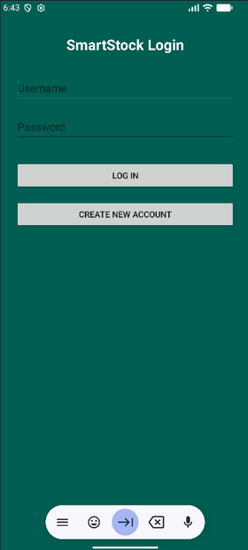
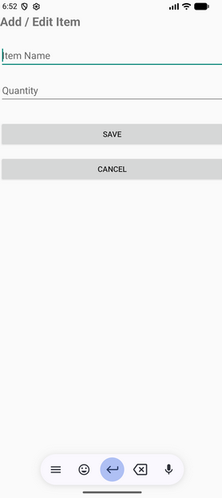
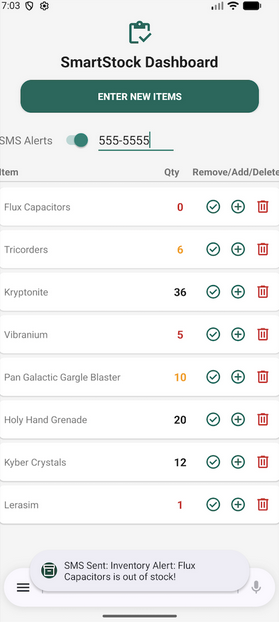

# CS-360-Mobile-Application-Development
## SmartStock Inventory Tracker

This repository contains my completed **Android mobile application**, developed for **CS-360 Mobile Application Development** at **Southern New Hampshire University**.

The project focuses on designing a lightweight inventory tracking application that allows users to manage stock levels, update quantities, and receive notifications when inventory runs out.

---

## 📌 Project Overview

SmartStock is a user-focused inventory tracking application designed for simplicity and clarity. The goal of the project was to build a practical tool that allows users to:

- Add inventory items  
- Adjust stock quantities  
- Receive SMS alerts when inventory reaches zero  
- Quickly identify low inventory using visual indicators  

Rather than building a complex enterprise system, the project emphasizes **clean UI design, focused functionality, and usability testing**.

---

## 📱 Application Preview

### SmartStock Login Screen


### Add Item Screen


### Inventory Dashboard / Low Inventory Example


---

## 📂 Repository Contents

| Folder/File | Description |
|-------------|-------------|
| `src/main/java` | Java source code for activities, adapters, and database logic |
| `src/main/res` | UI layouts, resources, and application assets |
| `AndroidManifest.xml` | Application configuration and permissions |
| `SmartStock_LaunchPlan.docx` | Project launch plan detailing app concept, Android compatibility, permissions, testing approach, and monetization ideas |
| `README.md` | Project documentation and reflection |
| `screenshots` | Folder containing app preview images |

---

## ⚙️ Technologies Used

- **Java**
- **Android Studio**
- **RecyclerView**
- **SQLite Database**
- **Android SDK**
- **XML Layout Design**

---

## 💡 Key Features

- Inventory item creation and management  
- Quantity tracking with real-time updates  
- Visual feedback for low inventory  
- SMS notification when items reach zero  
- Simple and intuitive user interface  

---

## 🧠 Development Approach

This application was built using an incremental development approach. Core features were developed and tested individually before integrating them into the final product.

The project focused on:

- Modular application structure  
- Clear UI navigation  
- Maintainable code organization  
- Practical usability improvements based on testing  

One of the most valuable lessons from the project came from early usability testing. Terminology that made sense from a maintenance perspective created confusion for new users. Adjusting the language and simplifying workflows significantly improved the overall experience.

---

## 🧩 Example Code

### RecyclerView Adapter Example

```java
public class InventoryAdapter extends RecyclerView.Adapter<InventoryAdapter.ViewHolder> {

    private List<Item> itemList;

    public InventoryAdapter(List<Item> itemList) {
        this.itemList = itemList;
    }

    @Override
    public void onBindViewHolder(ViewHolder holder, int position) {
        Item item = itemList.get(position);
        holder.itemName.setText(item.getName());
        holder.itemQuantity.setText(String.valueOf(item.getQuantity()));
    }
}
```
---

### Database Helper Example

```java
public class DatabaseHelper extends SQLiteOpenHelper {

    private static final String DATABASE_NAME = "inventory.db";

    public DatabaseHelper(Context context) {
        super(context, DATABASE_NAME, null, 1);
    }

    @Override
    public void onCreate(SQLiteDatabase db) {
        db.execSQL("CREATE TABLE inventory (id INTEGER PRIMARY KEY, name TEXT, quantity INTEGER)");
    }
}
```
---

### Runtime Permission Example

```java
if (ContextCompat.checkSelfPermission(this, Manifest.permission.SEND_SMS)
        != PackageManager.PERMISSION_GRANTED) {

    ActivityCompat.requestPermissions(this,
            new String[]{Manifest.permission.SEND_SMS},
            SMS_PERMISSION_CODE);
}
```
---

## 🧪 Testing

Testing focused on validating the core workflows of the application:

- Creating new inventory items

- Updating stock quantities

- Preventing negative inventory values

- Triggering SMS alerts at zero inventory

- Handling permission denial gracefully

Testing helped refine the interface and ensured the application behaved reliably across typical user scenarios.

---

## 🚧 Challenges and Improvements

One challenge during development was ensuring the application terminology and workflow made sense to users outside of a maintenance background. Early feedback showed that simplifying the interface and focusing on the most important actions significantly improved usability.

Future improvements could include:

- Cloud synchronization

- Barcode scanning

- Multi-device support

- Inventory analytics

- Custom alert thresholds

---

## 🎯 Skills Demonstrated

- Android application development

- UI/UX design for mobile devices

- Data management within mobile apps

- Runtime permission handling

- User-centered development

---

## Author

**Antoine Boylston**  
Southern New Hampshire University - CS-360 Mobile Application Development  
Portfolio Submission  


---


